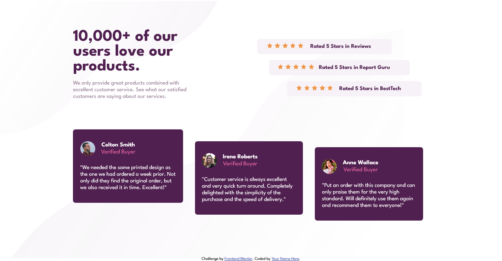
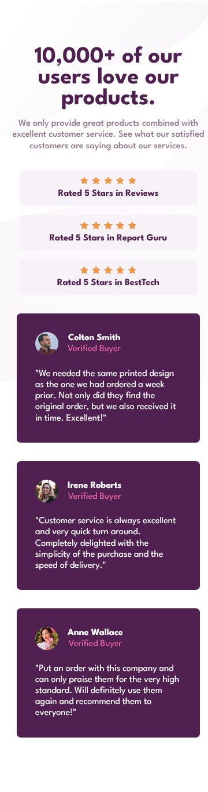

# Frontend Mentor - Social proof section solution

This is a solution to the [Social proof section challenge on Frontend Mentor](https://www.frontendmentor.io/challenges/social-proof-section-6e0qTv_bA). Frontend Mentor challenges help you improve your coding skills by building realistic projects.

## Table of contents

- [Overview](#overview)
  - [The challenge](#the-challenge)
  - [Screenshot](#screenshot)
  - [Links](#links)
- [My process](#my-process)
  - [Built with](#built-with)
  - [What I learned](#what-i-learned)
- [Author](#author)

## Overview

### The challenge

Users should be able to:

- View the optimal layout for the section depending on their device's screen size

### Screenshot




### Links

- Solution URL: [Frontend Mentor](https://www.frontendmentor.io/solutions/responsive-social-proof-section-using-flexbox-fF6j0Yu0ZR)
- Live Site URL: [Github Page](https://saadaan-hassan.github.io/Social-Proof-Section/)

## My process

### Built with

- Semantic HTML5 markup
- CSS custom properties
- Flexbox

### What I learned

This challenge was fun. I enjoyed completing this challenge. For the first time, I used these pseudo-elements:

1. first-child
2. nth-child()
3. last-child

Well using these elements make my task much easier.

```css
.testimonials:first-child {
  margin-left: 0;
}

.testimonials:nth-child(2) {
  margin-top: 5rem;
}

.testimonials:last-child {
  margin-top: 7rem;
}
```

## Author

- Frontend Mentor - [@Saadaan-Hassan](https://www.frontendmentor.io/profile/Saadaan-Hassan)
